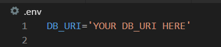

  ## 

  
  

  
  
  
  

  
  
  <!-- short description -->
  ### This Kubernetes Cluster Job and Cronjob visualizer and archiver delivers intuitive visualization of scheduled jobs, key metrics for all Jobs and Cronjobs deployed within your cluster, and the ability to seamlessly deploy new Jobs and Cronjobs via the application itself.

  
  

 <b>Getting Started</b>:

Welcome to Proteus! This guide will help you get started using our app. Whether you're a first-time user or just need a refresher, we've got you covered. We'll walk you through the setup process and show you how to use Proteus to its fullest potential.
If you're interested in more detailed information on Proteus' features and functionality, be sure to check out our documentation. But for now, let's dive in and get started with using our app!

<b>Prerequisites:</b> 
- You must be able to connect to a currently deployed kubernetes cluster via kubectl
- You must have Prometheus and Kube State Metrics deployed within your cluster
- A mongoDB URI

## Quick Start:

<b>Steps:</b>

1. Download our desktop application from GitHub or clone the repo, install dependencies, and npm start. 

 

 

2. Create a .env file within your root directory and change the string 'YOUR DB_FILE HERE' to whatever your DB URI is. 

3. Utilizing the provided yaml file template, replace "Your DB URI" on line 13 with your DB URI and replace "Your service IP" on line 15 with the service IP for the Prometheus Server pod within your cluster. Save this yaml file and record the file path as it will be necessary for the next step. 

 
YAML Template:

 

 

<i>Feel free to change line 4 from "db-bridge" to whichever name you want your job to possess.</i>

4. You will notice that line 10 of the yaml file includes a reference to ospproteus/proteus-image. This is an image hosted on Docker Hub which you will now deploy as a job within your cluster. To do so, deploy a new job using our application's "Create Job" form or by another means, such as via kubectl. 
    - Using kubectl, copy the following into your terminal:
    kubectl apply -f "THE FILE PATH FOR THE YAML FILE"
    - It may take slightly longer the first time after following these steps for metrics to be scraped from your cluster to be displayed within the application, but all subsequent use of the application will be significantly quicker. 

After following these steps, the application will begin displaying all Job and Cronjobs within your cluster. 

Apple Silicon users may experience intermitent issues upon application start. Most, if not all issues can be resolved by closing the application and reopening it. 

## Current Features

## Iteration Plans

## Connect with the Team!
| Mark Bryan | Bianca Hua | Eddy Kaggia | Matt Henely |
| :---: | :---: | :---: | :---: |
|   |   |   |   |

